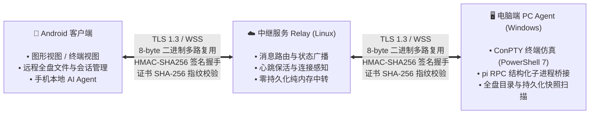
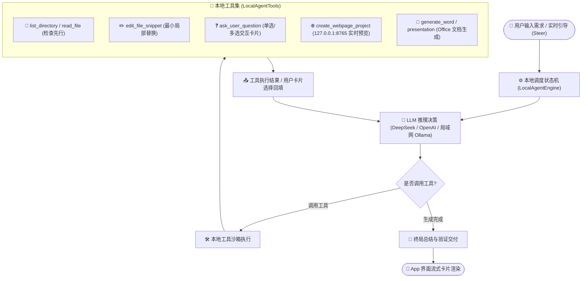

# Pi Remote (Android)

<p align="left">
  
  
  
  
  
</p>

Pi Remote 是一个在 Android 手机上远程控制电脑终端以及 AI 编程 Agent（如 Pi Agent）的客户端应用。通过轻量中继服务，在电脑无需公网 IP 和端口转发的情况下，实现手机端对电脑终端操作与 Agent 运行状态的查看与交互。

> 💡 **给 AI Agent 用户的极速上手指令**：
> 如果你正在使用 AI 编程助手（如 Claude Code、Cursor、Windsurf、Pi Agent、GitHub Copilot CLI 等），无需手动配置，克隆本项目后直接对你的 Agent 发送：
> 
> ```text
> 请阅读本项目 README.md，帮我检查当前电脑的环境依赖，配置好 agent/config.json 并运行脚本注册启动 PC Agent 服务。
> ```
> Agent 会自动检测你的 Node.js / PowerShell 环境、生成配置并完成电脑端守护服务的安装。

---

## 整体架构与互联机制

系统由 **Android 客户端**、**公网中继服务 (Relay)** 和 **电脑端代理 (PC Agent)** 三部分组成：



- **无需公网 IP**：电脑端运行 Agent 守护服务，主动向中继服务器发起 WebSocket 连接；手机端同样连接中继。两侧均为出站连接，电脑位于局域网或 NAT 路由器后也能正常使用。
- **通信安全**：采用 HMAC-SHA256 签名握手与 TLS 自签证书 SHA-256 指纹强校验（Certificate Pinning），无需配置商业 CA 域名证书。

---

## 快速上手与配置指南

系统使用需要三端配合：**部署中继服务器**、**电脑端运行 PC Agent**、**手机端配置连接**。

### 第一步：部署中继服务器（Relay）

中继服务器负责手机与电脑之间的流量转发（需要一台具有公网 IP 的云服务器，如 Debian / Ubuntu）：

1. **进入中继目录并运行部署脚本**：
   
   ```bash
   cd relay/
   sudo ./deploy.sh
   ```
2. **记录生成的凭据**：
   脚本会自动安装 systemd 守护服务、生成 TLS 1.3 自签证书，并在控制台输出配置信息：
   - **中继地址**：`wss://<你的服务器公网IP>:443/relay`（或备用端口 `8443`）
   - **设备 Token**：在 `/etc/pi-relay/config.json` 中配置的一组随机安全密钥
   - **证书 SHA-256 指纹**：格式形如 `AB:CD:EF:...`（64位十六进制）
3. **健康检查验证**：
   在任意设备上运行 `curl -sk https://<你的服务器公网IP>/healthz`，若返回 `{"ok":true}` 即表示中继运行正常。

---

### 第二步：电脑端配置（PC Agent）

电脑端作为受控端，桥接 Windows 底层终端（PowerShell）与 Pi Agent 进程：

1. **环境准备**：
   - 安装 Node.js 18+ 与 PowerShell 7 (`pwsh`)；
   - 若需使用图形工作台，安装 Pi 编码 Agent：`npm install -g @earendil-works/pi-coding-agent`。
2. **配置文件**：
   在 `agent/` 目录下创建 `config.json`（可参考 `config.example.json`）：
   
   ```json
   {
     "relay": {
       "endpoints": ["wss://<你的中继服务器IP>:443/relay"],
       "token": "<在relay生成的Token>",
       "pinnedSha256": "<在relay生成的证书SHA-256指纹>"
     },
     "agentId": "my-pc",
     "presets": [
       { "id": "pwsh", "name": "PowerShell 7", "type": "pty", "cwd": "C:/Users/YourName" },
       { "id": "pi", "name": "Pi Agent", "type": "rpc", "cwd": "D:/Projects" }
     ]
   }
   ```
3. **安装与启动服务**：
   - 右键管理员身份运行 `agent/install-service.cmd`，自动安装为 Windows 系统服务 `PiRemoteAgent` 并开机自启；
   - （或在终端手动前台调试启动）：`node agent/server.js`；
   - 启动后，PC Agent 会自动连接中继并在中继中注册在线状态。

---

### 第三步：手机端配置与使用（Android App）

1. **安装 APK**：
   编译生成的 APK 安装至手机，首次打开应用；
2. **配置连接参数**：
   - 点击应用右上角的 **「设置」** 图标；
   - **中继地址**：输入 `wss://<你的中继服务器IP>:443/relay`（每行一个，支持配置备用端口 `wss://<你的中继服务器IP>:8443/relay`）；
   - **设备 Token**：填入第二步中相同的 Token；
   - **证书指纹**：填入对应的 SHA-256 指纹（冒号分隔大写十六进制）；
   - 点击 **「保存并连接」**。
3. **日常操作流程**：
   - **查看连接状态**：返回主页，顶部状态栏显示 `已连接 · 电脑端 my-pc` 即表示链路打通；
   - **远程浏览全盘目录**：点击工作目录栏（Cwd），可直接远程浏览电脑上 C/D/E 等全盘目录并选定工作区；
   - **发起与管理会话**：点击预设卡片即可发起全新会话；正在运行的会话可随时点击「打开」接管或「终止」回收；
   - **双视图自由切换**：进入会话后，右上角一键在「图形卡片视图」与「底层终端视图」之间热切换；
   - **全双工中途引导**：在图形视图中，Agent 思考与跑测试期间输入框不锁定，随时可输入指导建议（Steer）实时矫正方向。

---

### 第四步：手机本地自主 AI Agent（Local AI Agent）

除了远程连接桌面端，应用内还原生内置了一套**直接运行在 Android 系统沙箱内的轻量级自主 AI Agent 引擎**。

#### 1. 架构渊源与设计哲学
该引擎在移动端深度吸收并融合了当今两大主流 Agent 系统的核心心智：
- **融合 Pi Agent 的全双工与交互机制**：
  - **全双工中途掌舵（Steering）**：手机端在 Agent 思考与执行工具时，输入通道保持畅通，支持随时注入动态引导指令（`steer`），调度器在检查点无感掉头；
  - **交互式主动反问（Ask User Question）**：遇到方案分歧时，Agent 会主动调用反问工具，以原生触控卡片（包含推荐标记 `(推荐)`）请求用户抉择；
- **融合 Claude Code 的工程闭环与代码修改准则**：
  - **认识论谦逊（Epistemic Humility）**：严禁凭空臆想文件内容，必须“先探查再操作”；
  - **局部最小差异代码编辑（Minimal Diff Editing）**：优先使用文本替换或局部 Patch，不随意大段覆写文件，保护缩进与现有结构；
- **移动端沙箱特化（内置 Web 预览服务）**：
  - 内置一个运行在 `127.0.0.1:8765` 的轻量 HTTP 服务器，当 Agent 编写前端/网页工具时，App 内直接以内嵌 WebView 提供即时交互式测试与预览。

#### 2. Local Agent 自主执行闭环回路


#### 3. 核心系统提示词准则（Core Directives & System Prompt）
引擎直接运行的核心指导提示词规范如下：

```text
You are Local AI Agent, an autonomous software engineering and generative creation agent running natively inside the user's Android phone.
Environment: Native Android application sandbox (no Termux, no root, no heavy build tools). Web assets should use CDN links or pure vanilla HTML/JS/CSS.

Core Directives:
1. Inspect First & Epistemic Humility: Never guess file contents or assume files exist. Always use `list_directory` or `read_file` to inspect the workspace before making changes.
2. Minimal Diff Editing: Prefer `edit_file_snippet` over rewriting entire files. Preserve existing code structure, indentation, and comments. Ensure valid syntax and balanced brackets/JSON.
3. Interactive Disambiguation (`ask_user_question`): When facing architecture choices, design forks, or ambiguous requirements, do NOT guess. Call `ask_user_question` with 2-4 concrete, distinct options (mark the recommended choice with "(推荐)"). Set `is_multi_select = true` only when choices are non-exclusive.
4. Dynamic Steering Ingestion: Injected steering messages have highest priority. Immediately pivot ongoing plans to align with the user's real-time redirection.
5. Rich Deliverables:
   - Web projects: Call `create_webpage_project` (spawns an internal HTTP server at 127.0.0.1:8765 and interactive in-app WebView).
   - Office docs: Call `generate_word_document` (.docx) or `generate_presentation` (.pptx) for rich documents viewable in WPS/Office.
6. Execution & Synthesis: Prioritize action via tools over commentary. After completing tool calls, always provide a complete, well-reasoned final summary in Chinese explaining the solution and how to verify it.
```

---

## 核心功能清单

- **双视图交互**：
  - **图形视图**：结构化展示思考过程折叠、工具调用记录与 Markdown 输出；遇到选项可直接在手机上触控点击选择；提供老旧 PTY 会话的文本解析兜底。
  - **终端视图**：基于 Termux 模拟内核，支持 ANSI 色彩；屏幕底部提供 `Ctrl`/`Alt`/`Tab` 等快捷按键栏；适配软键盘弹出防抖动避让。
- **全双工中途引导（Steering）**：在远程 Agent 思考或运行命令期间，随时插入引导指令实时调向。
- **远端目录与会话漫游**：手机端浏览电脑端全盘符文件系统，支持接管历史持久化会话快照。
- **手机内置终端环境**：内置 arm64 GNU Bash 与 BusyBox 核心命令集，支持脱机运行本地 Shell 脚本。

---

## 编译与构建

### 环境要求

- Android Studio Ladybug (2024.2) 或更高版本
- JDK 17
- Android SDK 35 (最低支持 Android 8.0 / API 26)

### 编译 APK

```bash
# 运行单元测试
./gradlew :terminal-emulator:test
./gradlew :app:test

# 编译 Debug APK
./gradlew :app:assembleDebug
```

产出路径：`app/build/outputs/apk/debug/app-debug.apk`。

---

## 许可证

- 终端模拟器底层组件源自 [Termux](https://github.com/termux/termux-app)，遵循 GPLv3 许可证（详见 [LICENSE-GPLv3.md](terminal-emulator/LICENSE-GPLv3.md)）。
- 其余代码遵循通用开源规范。
